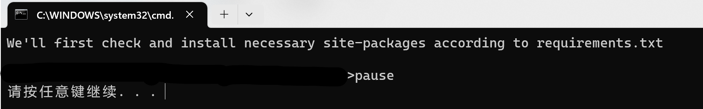
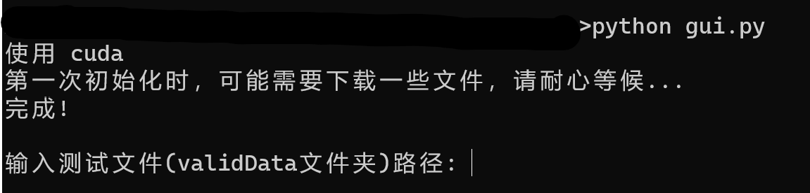
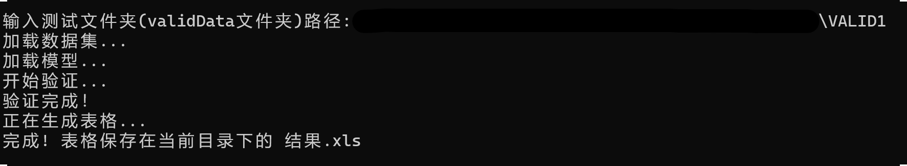

# RCS数据集预测模型使用文档

### Windows平台
将压缩包下载到本地并解压缩后，双击run.bat

当出现下图的界面时，按下任意键继续。程序会自动检查需要的第三方库并安装。(无关信息已被抹除)

待所有第三方库安装完成后，控制台交互脚本gui.py将会启动  
第一次运行时，程序会自动启动下载必要的资源，完成后即提供测试数据集文件夹路径的输入入口，如下图：

验证文件夹，即《比赛说明》中要求的validData文件夹。输入该文件夹的路径时，需要包含盘符。一个合法的路径的示例如下：  

`D:\DATA\validData`  

其中，validData文件夹内应当包含所有的 `frame_xxx.mat` 文件

在输入完成并按下回车后，程序将会启动模型进行数据处理。这一过程可能会耗费一段时间，请耐心等待。

如果运行顺利，你会得到如下的输出信息:
  

此时，可以退出程序，并在程序的目录下找到 `结果.xls` 文件。这一文件即为所需的测试结果。